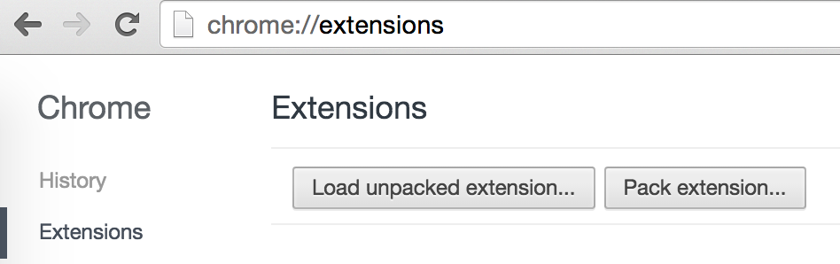

Pic2Trip
============

Chrome extension to search [Trip Advisor](http://tripadvisor.com) by image with
[Clarifai](http://clarifai.com).


## Installation

### The Normal Human Way

[Here it is in the Chrome Store](https://chrome.google.com/webstore/detail/pic2trip/gchkeemdfpeineieglldpjieppemjjla)

### The Super Cool Dev-y Way

Download this repo to the directory you want:

```
git clone https://github.com/cassidoo/pic2trip.git
```

To get started, get some application keys at [developer.clarifai.com](http://developer.clarifai.com).

You'll notice that in the `.gitignore` file, it references a `keys.js` file.
This is for security purposes, so you don't share your Client ID and Client
Secret with others.  Create a `keys.js` file and put it in the `src/bg` folder,
and have it look like the following:

```
var CLIENT_ID = 'your ID here';
var CLIENT_SECRET = 'your secret here';
```

Open up Chrome and go to `chrome://extensions`, and then hit
"Load unpacked extension..."



Now you just select the `pic2trip` directory, and you're all set!
